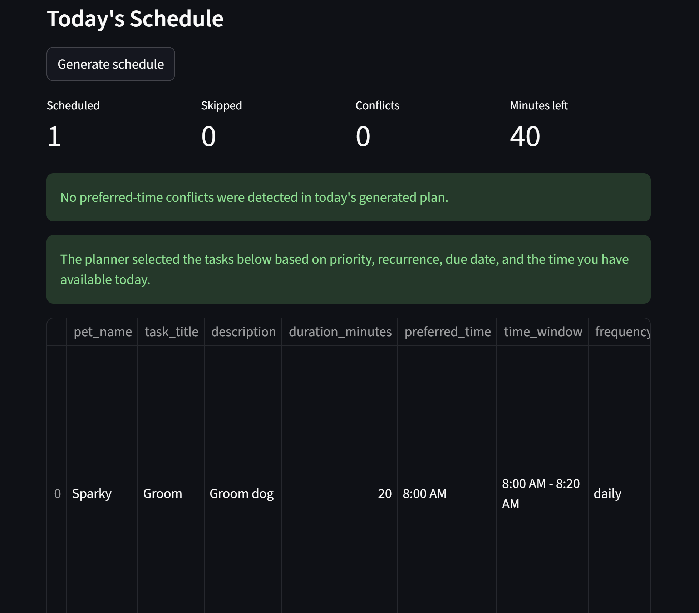

# PawPal+ (Module 2 Project)

You are building **PawPal+**, a Streamlit app that helps a pet owner plan care tasks for their pet.

## Scenario

A busy pet owner needs help staying consistent with pet care. They want an assistant that can:

- Track pet care tasks (walks, feeding, meds, enrichment, grooming, etc.)
- Consider constraints (time available, priority, owner preferences)
- Produce a daily plan and explain why it chose that plan

Your job is to design the system first (UML), then implement the logic in Python, then connect it to the Streamlit UI.

## What you will build

Your final app should:

- Let a user enter basic owner + pet info
- Let a user add/edit tasks (duration + priority at minimum)
- Generate a daily schedule/plan based on constraints and priorities
- Display the plan clearly (and ideally explain the reasoning)
- Include tests for the most important scheduling behaviors

## Smarter Scheduling

PawPal+ now includes a few lightweight scheduling algorithms that make the app
more practical for a busy pet owner:

- Tasks can be sorted by due date and preferred time so the day is easier to scan.
- Tasks can be filtered by pet and by status to focus on what still needs attention.
- Daily and weekly recurring tasks automatically create the next occurrence when completed.
- The scheduler detects overlapping preferred-time windows and returns warnings instead of failing.
- The daily plan uses priority, recurrence frequency, due date, and available minutes to decide what fits.

## Features

- Time-based sorting: tasks are ordered by due date first, then by preferred time, so the most immediate care windows appear first.
- Pet and status filtering: the task explorer can narrow results to one pet or to pending/completed work.
- Daily schedule generation: a greedy scheduler selects due tasks that fit within the owner's available minutes for the day.
- Priority-based ranking: higher-priority tasks are considered before lower-priority tasks when building the daily plan.
- Recurrence weighting: daily tasks are ranked ahead of weekly and monthly tasks when other factors are close.
- Preferred-time conflict warnings: overlapping task windows are detected and shown as warnings instead of breaking scheduling.
- Daily and weekly recurrence: completing a recurring task automatically creates the next occurrence on the correct future date.
- Duplicate recurrence protection: if the next recurring instance already exists, the system reuses it instead of creating duplicates.
- Due-today scheduling: the planner only schedules tasks due today or earlier, leaving future tasks out of today's plan.
- Schedule explanations: each scheduled task includes a short reason describing why it was selected.

## Getting started

### Setup

```bash
python -m venv .venv
source .venv/bin/activate  # Windows: .venv\Scripts\activate
pip install -r requirements.txt
```

### Run the app

```bash
streamlit run app.py
```

### Suggested workflow

1. Read the scenario carefully and identify requirements and edge cases.
2. Draft a UML diagram (classes, attributes, methods, relationships).
3. Convert UML into Python class stubs (no logic yet).
4. Implement scheduling logic in small increments.
5. Add tests to verify key behaviors.
6. Connect your logic to the Streamlit UI in `app.py`.
7. Refine UML so it matches what you actually built.

## Testing PawPal+

Run the test suite with:

```bash
python3 -m pytest
```

The tests cover the most important scheduler behaviors: task completion state, recurring task creation for daily and weekly tasks, filtering by pet and status, chronological sorting, conflict detection for overlapping or duplicate times, daily schedule generation, and edge cases such as pets with no tasks and avoiding duplicate future recurrences.

Confidence Level: 5/5 stars. Based on the current test results, the core scheduling, recurrence, and conflict-detection logic is behaving reliably for the main happy paths and the most important edge cases.

## Final architecture artifacts

- `uml_final.mmd` contains the final Mermaid class diagram for the implemented `Task`, `Pet`, `Owner`, and `Scheduler` classes.
- `uml_final.png` is an exported image version of that final architecture.

## UI highlights

- The task explorer uses scheduler-based filtering and chronological sorting.
- Today's schedule shows selected tasks, skipped tasks, remaining minutes, and conflict counts.
- Preferred-time conflicts are surfaced as clear Streamlit warnings so a pet owner can immediately see which tasks overlap and by how many minutes.


