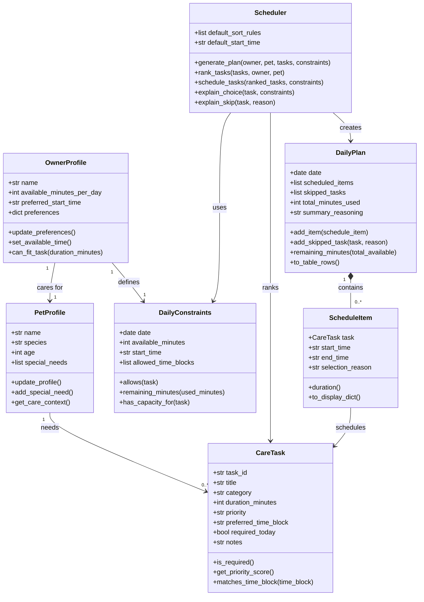

# PawPal+ Project Reflection

## 1. System Design

**a. Initial design**

- Briefly describe your initial UML design.

The initial UML design focuses on the relationship that an owner and their pet have with the daily schedule of tasks. The central object is the OwnerProfile, which "cares for" PetProfiles and "defines" DailyConstraints. The Scheduler builds a DailyPlan using the DailyConstraints that the user can use. 

- What classes did you include, and what responsibilities did you assign to each?

There are several main classes with some classes contained within others. The main objects are represented by OwnerProfile, PetProfile, and DailyPlan. The CareTask, and ScheduleItem classes define the tasks that a user actually needs to complete for their pet. The Scheduler uses the DailyConstraints to support, create, and rank CareTasks in the DailyPlan. 

**b. Design changes**

Yes, the design changed during implementation. The original UML was more detailed and included separate classes such as OwnerProfile, DailyConstraints, ScheduleItem, and DailyPlan. During implementation, I simplified the system into four core classes: Task, Pet, Owner, and Scheduler.

One important change was merging some of the planning-related classes into the Scheduler instead of keeping them as separate objects. Rather than creating a dedicated DailyPlan object with ScheduleItem entries, the scheduler now gathers tasks from all pets, prioritizes them, and returns a daily schedule as structured data. I made this change to make the first version simpler.

Other than that, some classes were renamed to fit the assignment spec better. 

---

## 2. Scheduling Logic and Tradeoffs

**a. Constraints and priorities**

- What constraints does your scheduler consider (for example: time, priority, preferences)?

The scheduler currently considers available time, task priority, task frequency, preferred time, and due date. Tasks are only added if they can fit in the owner's available time schedule, and after that tasks are ordered by priority, daily tasks are weighted heavier than weekly / monthly tasks, and earlier tasks are weighed heavier when other factors tie. 

- How did you decide which constraints mattered most?
Since the spec mentioned priority levels specifically, I figured that priority matters the most. Past that, obviously available time matters since a task can't be scheduled unless there's enough time to complete it. The frequency, preferred time, and due date are just tie breakers.

**b. Tradeoffs**

- Describe one tradeoff your scheduler makes.
The biggest tradeoff is the greedy scheduling. Just like the initial iteration of the backend had, the current scheduler picks tasks in ranked order as it gets them and stops scheduling when the schedule runs out of time. This keeps the logic fast and simple rather than searching for the 100% most optimal schedule of tasks. 

- Why is that tradeoff reasonable for this scenario?
Instead of chasing the absolute best solution with a dynamic programming solution or something even more complex, this solution prioritizes the priority level to accomplish the highest priority tasks even at the expense of many lower priority tasks. This is an acceptable solution from a performance and complexity perspective and may even be ideal depending on how strict the given priorities are. 

---

## 3. AI Collaboration

**a. How you used AI**

- How did you use AI tools during this project (for example: design brainstorming, debugging, refactoring)?
- What kinds of prompts or questions were most helpful?

**b. Judgment and verification**

- Describe one moment where you did not accept an AI suggestion as-is.
- How did you evaluate or verify what the AI suggested?

---

## 4. Testing and Verification

**a. What you tested**

- What behaviors did you test?
- Why were these tests important?

**b. Confidence**

- How confident are you that your scheduler works correctly?
- What edge cases would you test next if you had more time?

---

## 5. Reflection

**a. What went well**

- What part of this project are you most satisfied with?

**b. What you would improve**

- If you had another iteration, what would you improve or redesign?

**c. Key takeaway**

- What is one important thing you learned about designing systems or working with AI on this project?
