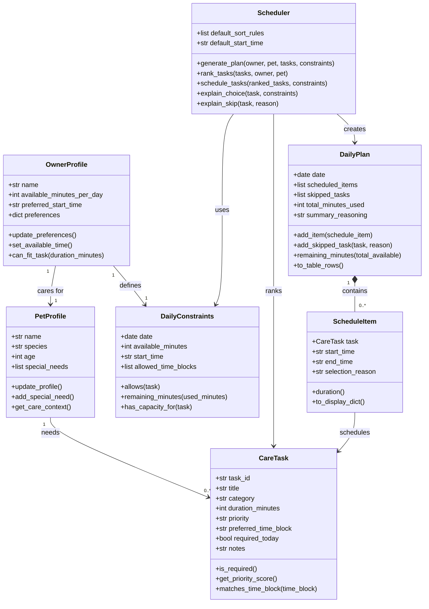

# PawPal+ Project Reflection

## 1. System Design

**a. Initial design**

- Briefly describe your initial UML design.

The initial UML design focuses on the relationship that an owner and their pet have with the daily schedule of tasks. The central object is the OwnerProfile, which "cares for" PetProfiles and "defines" DailyConstraints. The Scheduler builds a DailyPlan using the DailyConstraints that the user can use. 

- What classes did you include, and what responsibilities did you assign to each?

There are several main classes with some classes contained within others. The main objects are represented by OwnerProfile, PetProfile, and DailyPlan. The CareTask, and ScheduleItem classes define the tasks that a user actually needs to complete for their pet. The Scheduler uses the DailyConstraints to support, create, and rank CareTasks in the DailyPlan. 

**b. Design changes**

- Did your design change during implementation?
- If yes, describe at least one change and why you made it.

---

## 2. Scheduling Logic and Tradeoffs

**a. Constraints and priorities**

- What constraints does your scheduler consider (for example: time, priority, preferences)?
- How did you decide which constraints mattered most?

**b. Tradeoffs**

- Describe one tradeoff your scheduler makes.
- Why is that tradeoff reasonable for this scenario?

---

## 3. AI Collaboration

**a. How you used AI**

- How did you use AI tools during this project (for example: design brainstorming, debugging, refactoring)?
- What kinds of prompts or questions were most helpful?

**b. Judgment and verification**

- Describe one moment where you did not accept an AI suggestion as-is.
- How did you evaluate or verify what the AI suggested?

---

## 4. Testing and Verification

**a. What you tested**

- What behaviors did you test?
- Why were these tests important?

**b. Confidence**

- How confident are you that your scheduler works correctly?
- What edge cases would you test next if you had more time?

---

## 5. Reflection

**a. What went well**

- What part of this project are you most satisfied with?

**b. What you would improve**

- If you had another iteration, what would you improve or redesign?

**c. Key takeaway**

- What is one important thing you learned about designing systems or working with AI on this project?
