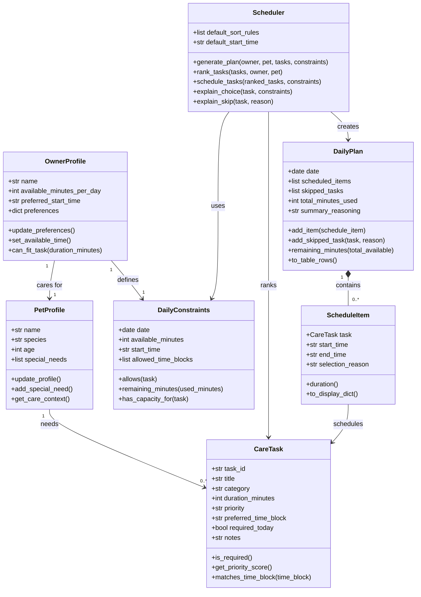

# PawPal+ Project Reflection

## 1. System Design

**a. Initial design**

- Briefly describe your initial UML design.

The initial UML design focuses on the relationship that an owner and their pet have with the daily schedule of tasks. The central object is the OwnerProfile, which "cares for" PetProfiles and "defines" DailyConstraints. The Scheduler builds a DailyPlan using the DailyConstraints that the user can use. 

- What classes did you include, and what responsibilities did you assign to each?

There are several main classes with some classes contained within others. The main objects are represented by OwnerProfile, PetProfile, and DailyPlan. The CareTask, and ScheduleItem classes define the tasks that a user actually needs to complete for their pet. The Scheduler uses the DailyConstraints to support, create, and rank CareTasks in the DailyPlan. 

**b. Design changes**

Yes, the design changed during implementation. The original UML was more detailed and included separate classes such as OwnerProfile, DailyConstraints, ScheduleItem, and DailyPlan. During implementation, I simplified the system into four core classes: Task, Pet, Owner, and Scheduler.

One important change was merging some of the planning-related classes into the Scheduler instead of keeping them as separate objects. Rather than creating a dedicated DailyPlan object with ScheduleItem entries, the scheduler now gathers tasks from all pets, prioritizes them, and returns a daily schedule as structured data. I made this change to make the first version simpler.

Other than that, some classes were renamed to fit the assignment spec better. 

---

## 2. Scheduling Logic and Tradeoffs

**a. Constraints and priorities**

- What constraints does your scheduler consider (for example: time, priority, preferences)?

The scheduler currently considers available time, task priority, task frequency, preferred time, and due date. Tasks are only added if they can fit in the owner's available time schedule, and after that tasks are ordered by priority, daily tasks are weighted heavier than weekly / monthly tasks, and earlier tasks are weighed heavier when other factors tie. 

- How did you decide which constraints mattered most?
Since the spec mentioned priority levels specifically, I figured that priority matters the most. Past that, obviously available time matters since a task can't be scheduled unless there's enough time to complete it. The frequency, preferred time, and due date are just tie breakers.

**b. Tradeoffs**

- Describe one tradeoff your scheduler makes.
The biggest tradeoff is the greedy scheduling. Just like the initial iteration of the backend had, the current scheduler picks tasks in ranked order as it gets them and stops scheduling when the schedule runs out of time. This keeps the logic fast and simple rather than searching for the 100% most optimal schedule of tasks. 

- Why is that tradeoff reasonable for this scenario?
Instead of chasing the absolute best solution with a dynamic programming solution or something even more complex, this solution prioritizes the priority level to accomplish the highest priority tasks even at the expense of many lower priority tasks. This is an acceptable solution from a performance and complexity perspective and may even be ideal depending on how strict the given priorities are. 

---

## 3. AI Collaboration

**a. How you used AI**

- How did you use AI tools during this project (for example: design brainstorming, debugging, refactoring)?
I used AI for all of the above. When it came to designing and brainstorming, I bounced some of my ideas off of it for feedback and pushed back on some decisions that it made. Once we had a concrete implementation plan in place, I agreed with a lot of the actual code changes it made, and I reviewed it to make some small tweaks and asked it questions to better understand why it made the decisions that it did. 

- What kinds of prompts or questions were most helpful?
The prompts that get the best results are the ones that give the AI the most context. When designing, I basically just info dump all of my thoughts into the chat, and the AI does a great job of extracting what's important and working around the constraints I give it. When it comes to asking questions, I think it's important to define a proper scope. A chatbot can only return so much text per prompt, so when I ask questions I make sure to scope it down to specific functions or lines of code that I want to understand so I get an answer with satisfactory depth that isn't just a brief overview of the whole file or module. 

**b. Judgment and verification**

- Describe one moment where you did not accept an AI suggestion as-is.
During the initial design, AI came up with a complex architecture involving several subclasses of tasks and constraints. This was fine for the skeleton, but I then realized that the assignment was looking for 4 core classes that I didn't have super well defined. So I went back and gave the AI some more context and it was able to pivot to the simpler architecture of 4 classes representing the actual entities at play.

- How did you evaluate or verify what the AI suggested?
My first step is always reading through whatever AI generates in its entirety. Sometimes there are little footnotes or comments or disclaimers that can waste a lot of time if you miss them on the first scan. If it's code that the AI generated, then I'll read through it, ask questions, understand it line by line, and step through it with an example. That way I can understand the logic behind the code, which is important when it comes to debugging later on. One other method I use is handing the output off to another agent. Usually I'll switch models as well. For example if I'm implementing something with a Codex model, I'll ask Opus on Claude Code to write a code review and poke holes in the logic. 

---

## 4. Testing and Verification

**a. What you tested**

- What behaviors did you test?
The new and improved test suite contains a lot of cases, both happy cases and edge cases. It tests the test completion mechanism, the recurrence when completing a task, simple cases like task counts and filtering, sorting correctness, conflict detection, and the whole schedule generation process. 

- Why were these tests important?
The tests are important to show the core functionality of the app works. They can also be used as regression tests, anytime a new change is made, running the test suite can confirm that the change didn't break anything that came previously. 

**b. Confidence**

- How confident are you that your scheduler works correctly?
I'm pretty confident the scheduler works correctly. The test suite is reasonably broad and all the test cases pass. I'm not completely confident because the tests are still just mainly unit tests rather than end to end system tests that incorporate the UI as well. 

- What edge cases would you test next if you had more time?
I'd like to explore edge cases from the UI some more just by manually testing it. For edge cases in the actual tests, it could be useful to add tests that check input validation, like passing negative or 0 values to scheduling functions and making sure that they can handle real, unpredictable user input.  

---

## 5. Reflection

**a. What went well**

- What part of this project are you most satisfied with?
I think the backend logic is satisfyingly robust. I'm happy with how the logic evolved from extremely simple scheduling to an actual usable scheduler that considers many different constraints at varying priorities. 

**b. What you would improve**

- If you had another iteration, what would you improve or redesign?
I think I would build out a UI that wasn't Streamlit. Streamlit is great for getting something going fast, but I'd prefer having a full fledged UI framework like React to work with. That way I could redesign the UI to be multi page and define specific components that I can reuse throughout. I'd also add a more robust scheduler that does search for and select the absolute most optimal schedule in terms of tasks completed like I mentioned in an earlier section. Though that would come with a performance tradeoff, so I'd have to have some sort of selection mechanism that determines whether it's worth it to run the comprehensive schedule or stick with the current lightweight scheduling logic. That could also be a feature that I pass on to the user as an option ("thinking mode").

**c. Key takeaway**

- What is one important thing you learned about designing systems or working with AI on this project?

AI is pretty good at desigining and building out test cases, but sometimes it can get carried away with the implementation and build something you didn't ask it to or over engineer a feature that just doesn't need to be that complex. 